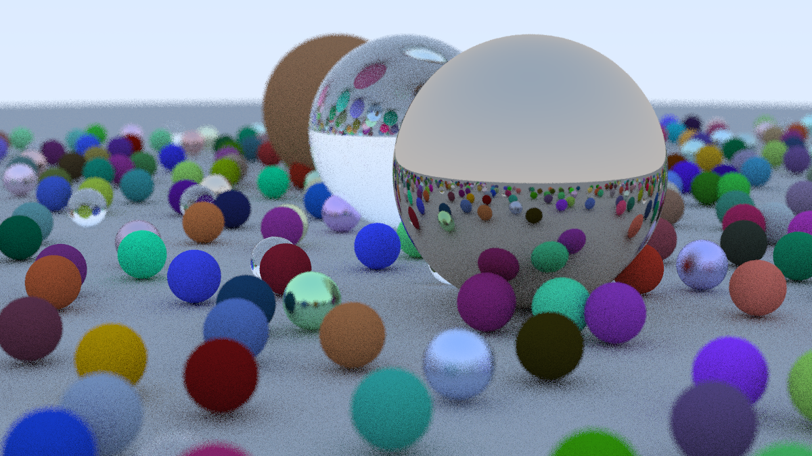

# CUDA Raytracer (InOneWeekend -> CUDA)

Este repositório contém uma adaptação do código do livro/tutorial "Ray Tracing in One Weekend" para utilizar CUDA, com o objetivo de executar o render na GPU. O trabalho teve como base o material do site oficial do projeto: https://raytracing.github.io (código e conteúdo de Peter Shirley).

Objetivo
-------
Converter a implementação didática do "In One Weekend" para usar CUDA, mantendo a estrutura original do código C++ quando possível e adicionando kernels/estruturas compatíveis com CUDA para acelerar o traçado de raios.

Atribuição
----------
O material original do qual este projeto se baseia foi escrito por Peter Shirley e está disponível em https://raytracing.github.io. Este repositório é uma adaptação/experimento pessoal para portar partes do código para CUDA.

Requisitos
----------
- NVIDIA GPU com driver compatível
- CUDA Toolkit (nvcc) instalado
- ImageMagick (opcional, para converter PPM -> PNG)

Como compilar
--------------
No diretório do projeto, use o `Makefile` incluído:

```bash
make
```

Isso criará o binário em `build/raytracer`.

Como executar
--------------
Para gerar uma imagem PPM (a saída do programa é escrita em stdout):

```bash
make run
```

O arquivo gerado ficará em build/out.ppm

Para converter para PNG e visualizar (se tiver ImageMagick):

```bash
convert build/out.ppm build/out.png
xdg-open build/out.png
```

Testes rápidos
--------------
Para iterações mais rápidas durante desenvolvimento, reduza em `main.cc` os valores de `image_width` e `samples_per_pixel` (por exemplo `300` e `2`) e recompile.

Estrutura importante
-------------------
- `main.cc` - cria a cena e configura a câmera / parâmetros
- `cuda_renderer.cu`, `raytracing_cuda.cu` - código do renderer e kernels CUDA
- `cuda_types.h` - estruturas compartilhadas entre host e device
- `Makefile` - regras simples para compilar e rodar; produz binário em `build/`

Problemas comuns
-----------------
- "nvcc: command not found": instale o CUDA Toolkit e adicione `nvcc` ao `PATH`.
- Erros de link com `curand`: o `Makefile` já linka `-lcurand`; verifique se o toolkit está corretamente instalado.
- Tempo de render muito longo: reduza resolução/samples para testes.

Licença e notas finais
----------------------
O código original didático (Peter Shirley) está liberado em domínio público/CC0 conforme indicado pelo autor. Esta adaptação segue a mesma intenção educacional e é um experimento pessoal para estudar port de código para CUDA.

